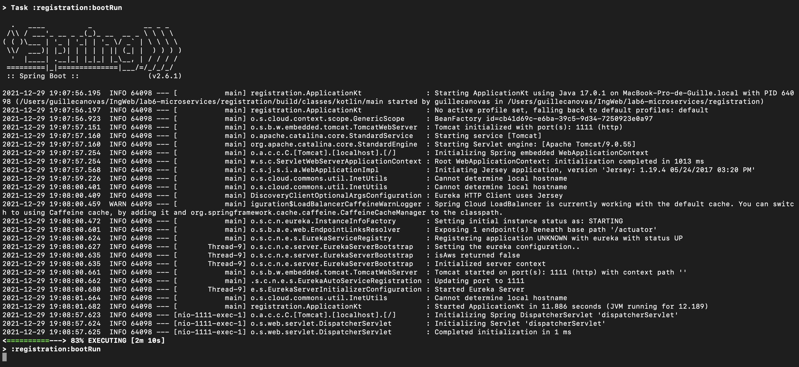
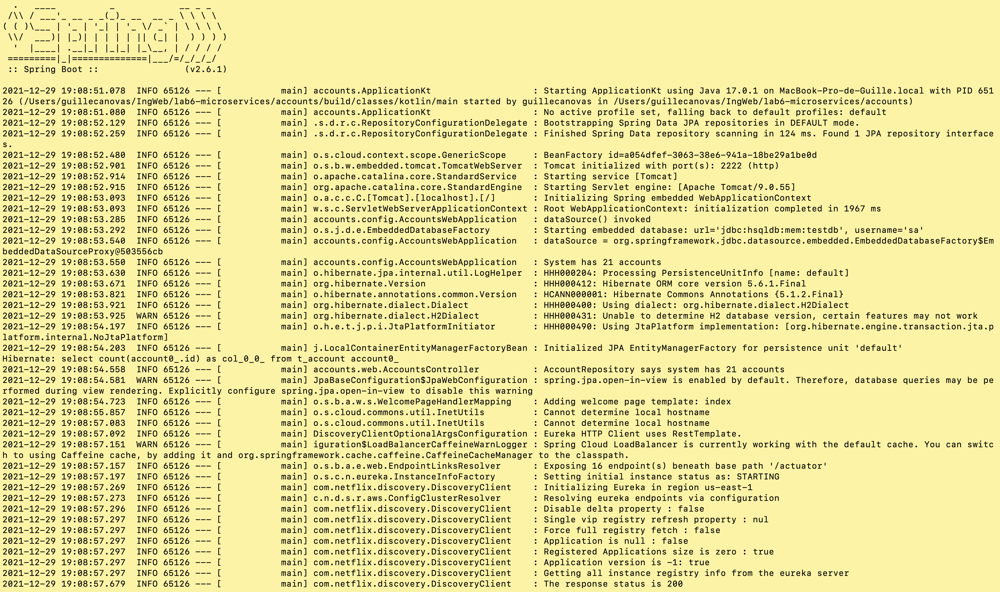
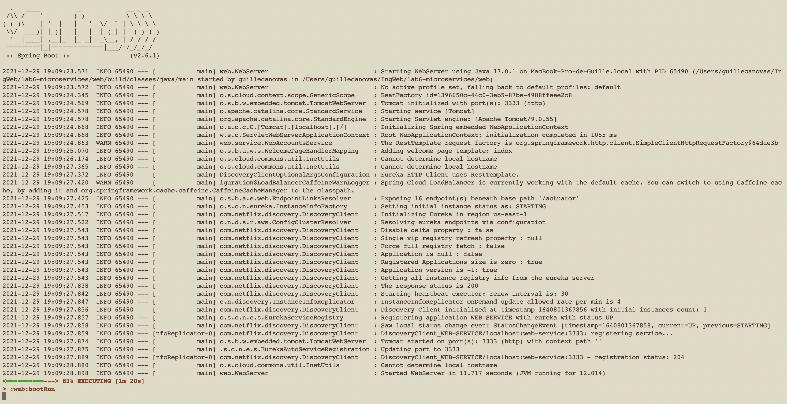
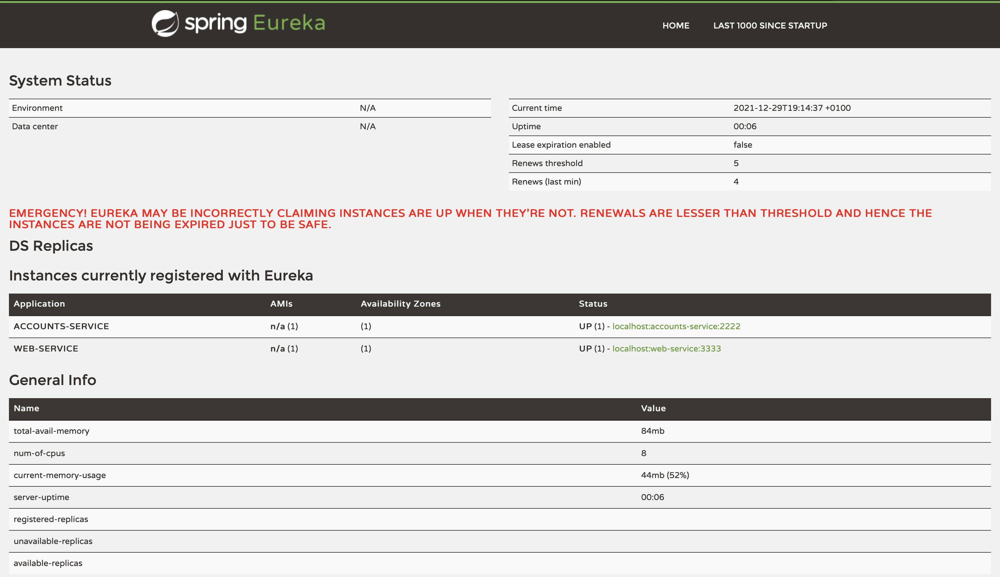
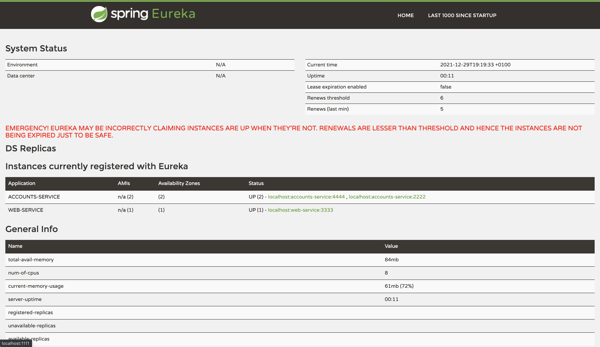
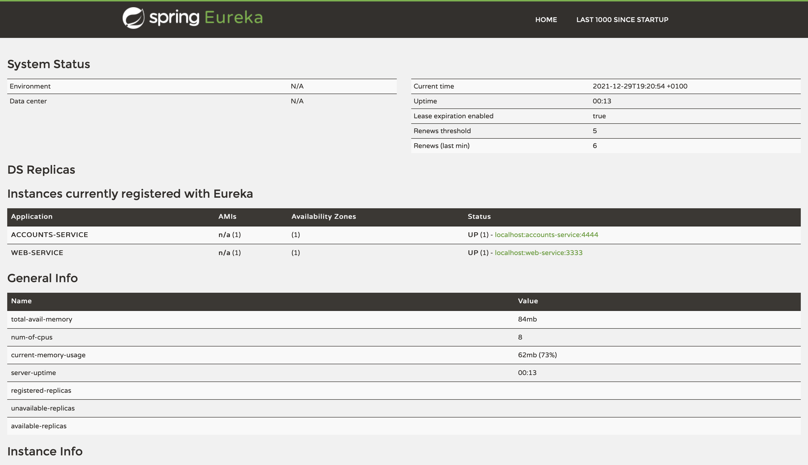
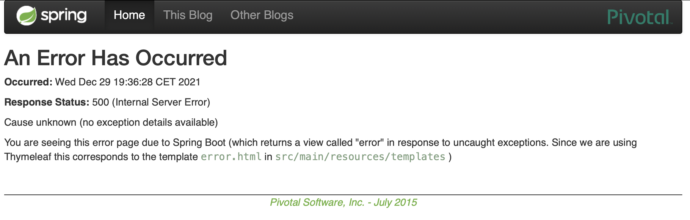
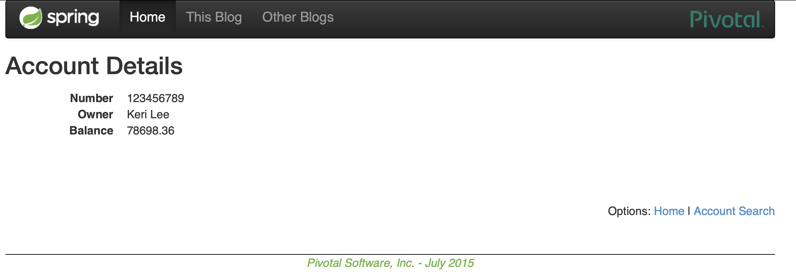

# Web Engineering 2021-2022 / microservices
## Guillermo Cánovas González (755848)

### The two services accounts (2222) and web are running and registered (two terminals, logs screenshots).

First, we must run the next commands: 

```
./gradlew :registration:bootRun
./gradlew :accounts:bootRun
./gradlew :web:bootRun
```

This is the result of running the command `./gradlew :registration:bootRun`:


Now, in this screenshots of both terminals (account and web) we can see the logs of both services:

#### Accounts service



#### Web service




## The service registration service has these two services registered (a third terminal, dashboard screenshots)
Now that the services are properly running, we can connect to `localhost:1111` and check that the services are registered in __Eureka__



## A second accounts service instance is started and will use the port 4444. This second accounts (4444) is also registered (a fourth terminal, log screenshots).

At this point, we must modify the file `accounts/src/main/resources/application.yml` in order to launch a second accounts service instance in the port 4444.

Now, we must check that this second accounts service is also registered in __Eureka__ so we just do the same as before.

The screenshot below shows that the new service instance is registered: 




## What happens when you kill the service accounts (2222) and do requests to web?

If we kill the service accounts in 2222 it just disappears from the Eureka dashbord just as we can see:


Now, if we do requests to web as we can see it just returns 500 (Internal Server Error):



## Can the web service provide information about the accounts again? Why?

As we saw before, Eureka was showing us an error type (500) that indicates that the server encountered an unexpected condition that prevented it from fulfilling the request. If we wait a little bit we can see that Eureka returns the account information without any type of error. Why? This is because Eureka now can detect that the service asked before is dead and no longer redirects to the 2222 and just redirects to 4444.


